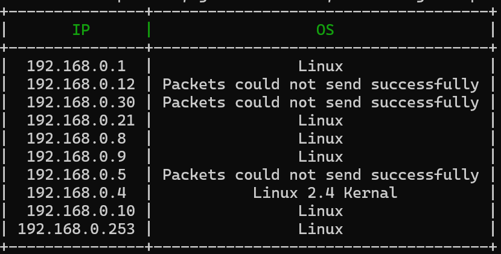

# Simple Network Scanner
This is a basic network scanner written with Python. This tool will get all devices IP and MAC addresses connected to a network. 

## Install Dependencies
Install the Python dependencies using the `dependencies.txt` file. 

Use the following command: `pip3 install -r dependencies.txt`

Also, make sure to download the [NPCAP latest version](https://npcap.com/#download) for Windows.

## Usage
To get the list of the devices connected to the network run the following command:
`python3 main.py -t [IP address range]`

Where `[IP address range]` should be in CIDR notation, i.e. `192.168.1.1/24`

**Note: MAC column was removed from picture for security purposes.**

## License

[MIT](https://choosealicense.com/licenses/mit/)